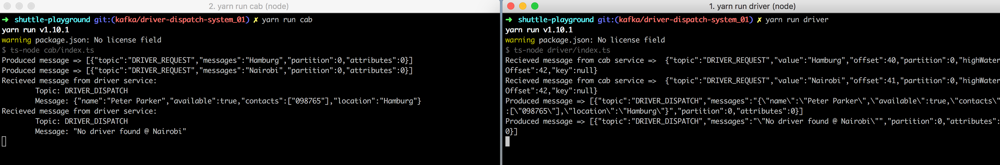

## Driver Dispatch System: Kafka Implementation

### Description
For a detailed description, click [here](https://docs.google.com/document/d/1ueHGxEIbjpgKhUZSL9BQYaKtuKSh-5upA7G7osAB6f8/edit?usp=sharing)

### Kafka setup

- Install java 8

        brew cask install homebrew/cask-versions/java8

- Install kafka and start up zookeeper and kafka

        brew install kafka
        brew services start zookeeper
        brew services start kafka

- Create topics:

        sudo /usr/local/Cellar/kafka/2.0.0/bin/kafka-topics --create --zookeeper localhost:2181 --replication-factor 1 --partitions 1 --topic DRIVER_REQUEST
        sudo /usr/local/Cellar/kafka/2.0.0/bin/kafka-topics --create --zookeeper localhost:2181 --replication-factor 1 --partitions 1 --topic DRIVER_DISPATCH

- List topics
        
        sudo /usr/local/Cellar/kafka/2.0.0/bin/kafka-topics --list --zookeeper localhost:2181

### Setup

- For simplicity, the `cab` and `driver` microservices have been reduced to modules.
- Currently you have to manually create the topics using the commands above, but this can be done programmatically
- To run the application, we have to run both modules separately. In one terminal, run the following:

        yarn run cab

- In another terminal, run the following:

        yarn run driver

